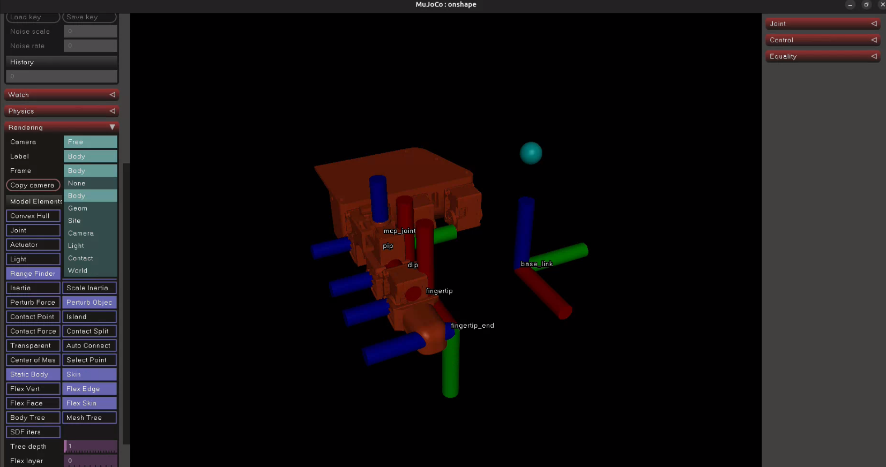
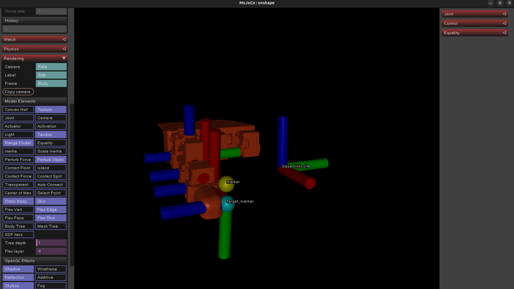

# Leap-hand-tipcontrol-tutorial

A concise walkthrough to convert a URDF to MuJoCo (MJCF), validate a tool reference frame, and test tip-control with included scripts.

## Overview
This repo demonstrates:
- Optional: add a tool link/joint to URDF for a custom end-effector reference
- Convert URDF -> MJCF
- STEP 1: fix the generated XML so it doesn't fall in MuJoCo
- Validate the tool frame (in MuJoCo viewer)
- STEP 2: add actuators/sensors for tip-control
- Test control using the provided scripts

## Prerequisites
Install dependencies (example):
```bash
sudo apt install python3.11 python3.11-venv
python3.11 -m venv tip_control_venv
source tip_control_venv/bin/activate

cd ~/Leap-hand-tipcontrol-tutorial/
python -m pip install --upgrade pip
python -m pip install -r requirements.txt
```

## Optional: URDF tool frame (do this before conversion)
Add a fixed link & joint in your URDF if you want a dedicated tool frame (e.g., link `fingertip_end` and fixed joint id `4`). This gives a predictable reference to target from the end-effector.

## Convert URDF to MJCF
Convert the URDF with:
```bash
cd ~/Leap-hand-tipcontrol-tutorial/
urdf2mjcf path/to/.urdf --output path/to/.xml
# In this example
urdf2mjcf ./urdf/robot.urdf --output xml/robot.xml
```
This writes the MuJoCo XML to `xml/robot.xml`.

## STEP 1 — Fix the generated XML (mandatory)
Open `xml/robot.xml` and follow STEP 1 from `robot_template.xml` in this repo:
- Fix base links to avoid falling (e.g., set freejoint/floating base to fixed or add constraints).
- Fix initial poses or inertias if needed.

Make these STEP 1 changes before running the viewer.

## Validate the reference frame in MuJoCo (after STEP 1)
Open the viewer:
```bash
cd ~/Leap-hand-tipcontrol-tutorial/
python view_mjcf.py path/to/.xml
# In this example
python view_mjcf.py xml/robot_template.xml
```
In MuJoCo Viewer:
- Set "Rendering" -> "Label" and "Frame" to "Body" to inspect frames and names.
- Verify the tool frame (e.g., `fingertip_end`) is where you expect it.

Screenshot (visual aid):


If the frame is misaligned, adjust the URDF/tool link and re-run convert + STEP 1.

## STEP 2 — Add actuators, sensors and control bodies
Once STEP 1 validation is OK:
- Make STEP 2 edits in `xml/robot.xml` following `robot_template.xml`.
- STEP 2 adds positions controlled actuators/actuator and their mappings, a `marker` and a `target_marker` body, and any sensor or geom markers needed for control.

After STEP 2, test manual control with the Control tab (sliders) in the viewer.

## Validate actuators
Open the viewer:
```bash
cd ~/Leap-hand-tipcontrol-tutorial/
python view_mjcf.py path/to/.xml
# In this example
python view_mjcf.py xml/robot_template.xml
```

## Test control with the script
Run the controller that uses IK or direct control to move the tip:
```bash
cd ~/Leap-hand-tipcontrol-tutorial/

# Use defaults
python control.py

# Or specify URDF and XML paths explicitly:
python control.py --urdf /path/to/.urdf --xml /path/to/.xml

# In this case
python control.py --urdf ./urdf/robot.urdf --xml ./xml/robot_template.xml
```
Notes:
- `control.py` uses ikpy (or your chosen IK) and sends targets relative to last link or your `fingertip_end` link.
- Adjust your target points to match the chosen reference frame.

Rendering tips: set rendering to show labels and frames; the viewer markers:
- `marker` (yellow) — the reference frame at the end-effector
- `target_marker` (light blue) — the commanded target position

Screenshot (visual aid):


## Quick commands summary
```bash
# Optional: Add a tool/frame to your URDF (do this BEFORE converting)
# (e.g., add a fixed link 'fingertip_end' and a fixed joint so you have a predictable end-effector frame)

# 1. Convert URDF -> MJCF
urdf2mjcf /path/to/.urdf --output /path/to/.xml

# 2. STEP 1: Edit xml/robot.xml to stabilize/fix the base
# Make STEP 1 changes from robot_template.xml (prevent falling/spinning)

# 3. Validate frames and body names in MuJoCo Viewer (AFTER STEP 1)
python view_mjcf.py /path/to/.xml
# In Viewer: set Rendering -> Label and Frame to 'Body' and inspect the tool frame
# See assets/MuJoCo_rendering.png for suggested viewer settings

# 4. If needed: adjust URDF/tool link, re-convert and re-apply STEP 1

# 5. STEP 2: Edit xml/robot.xml and add actuators/targets/sensor bodies
# Apply STEP 2 changes from robot_template.xml (target_marker, actuators, etc.)

# 6. Validate actuators and manual control in the Viewer (Control tab sliders)
python view_mjcf.py /path/to/.xml
# Confirm 'marker' (yellow) and 'target_marker' (light blue) are present

# 7. Run programmatic tip control (specify URDF/XML if not using defaults)
python control.py --urdf /path/to/.urdf --xml /path/to/.xml
```

## Troubleshooting
- Robot falls/spins: re-check STEP 1 edits (base constraints).
- Markers missing: check site definitions in the XML.
- Control not working: check actuator and default class definitions

## Files of interest
- `xml/robot.xml` — generated MJCF (apply STEP 1 & STEP 2)
- `robot_template.xml` — example STEP 1 & STEP 2 edits
- `view_mjcf.py` — opens MuJoCo viewer
- `control.py` — tip-control script
